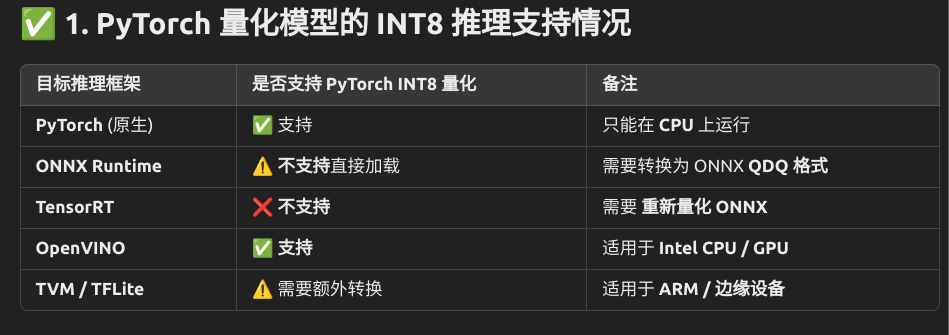

2025/2/25

在经过成功训练模型，成功推理过后。 

将Pytorch模型转化为onnx模型，再使用tensortRT进行推理，性能提升的其实并不多，甚至只有一点，现在开始进行静态量化

2/26

在静态量化过程中，Pytorch并不支持ConvTranspose2d的per-channel量化

解决方法1、跳过ConvTranspose2d的量化，如果ConvTranspose2d并不是计算瓶颈的话
解决方法2、强制使用Per-Tensor量化

先采用解决方法1,跳过ConvTranspose2d量化
```python
from torch.ao.quantization import get_default_qconfig, QConfig
from torch.ao.quantization import MinMaxObserver, PerChannelMinMaxObserver

# 创建一个函数，递归地为每个层设置 qconfig
def apply_qconfig(module):
    if isinstance(module, torch.nn.ConvTranspose2d):
        module.qconfig = None  # 跳过量化
    else:
        module.qconfig = get_default_qconfig("fbgemm")  # 默认 qconfig

quantized_model.apply(apply_qconfig)  # 递归应用 qconfig
quantized_model = torch.quantization.prepare(quantized_model)
```
挖个大坑：pytorch量化int8后，无法直接使用tensorrt进行推理！


/2/27

今天的坑是tensorrt并不支持INT64和double类型，只支持Int32和float
目前解决 量化校准集的问题，好像catch到的数据不对劲

2/28


